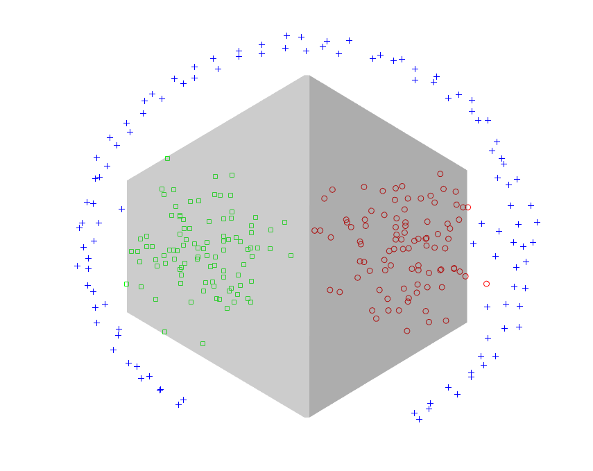

# Morphological Perceptron and Hybrid Morphological/Linear Perceptron

MATLAB codes for the article (to be published) on Morphological and Hybrid Morphological/Linear Perceptrons that are trained by extreme learning machine technique.

The image below shows the decisionline for the Morphological Perceptron on the pathbased dataset. The big advantage of this model is the possibility of non-differencial decision curves trained rapidly with great capacity for generalization due to the learning method.

The code to reproduce the results is available at _example_decision_line.m_.
